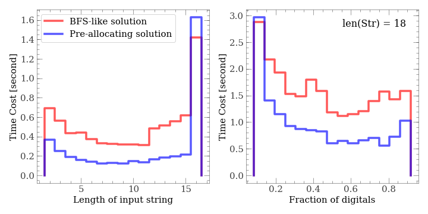

# Project Leetcode Solution

## About

This repository collects the nice solutions to leetcode [Algorithm problems](https://leetcode.com/problemset/algorithms/).

Authors: Zili Yuan, Yangyao Chen, Young Wu (ranked by random shuffle).

Comments and contritbutions are welcomed.

### What are we doing?

**Discussion:** Each day we determine which problem is to be solved, discuss the possible solution online, exchange good ideas.

**Coding:** We write code in different languages, use different algorithms, and for each algorithm we also try several implementations.

**Summary:** We compare the performance of algorithms (see figure below for an example), try to find possible extensions of the algorithm to other possible problems, and write short *discussion* for some interesting problems and algorithms.

<table border="1"><tr><td></td></tr></table>

## Solutions

Person in charge

**[Problem List](problems/README.md):** in-turn

* Problems are categorized according to their associated data structures. See [Problem Categories](problems/categories.md)

**Implemetations**

* [Python](python): Zili Yuan  
* [C++](cpp): Yangyao Chen (homepage: [http://www.chenyangyao.com](http://www.chenyangyao.com))

* [Swift](swift): Young Wu
