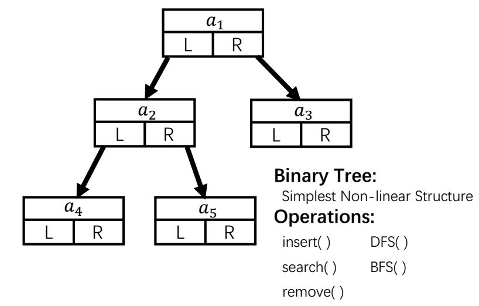
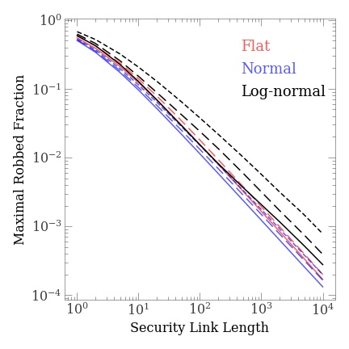

# Project Leetcode Solution

## About

This repository collects the nice solutions to leetcode [Algorithm problems](https://leetcode.com/problemset/algorithms/).

We also provide some self-gathered questions, with negative No. in the problem list.

Authors: Zili Yuan, Yangyao Chen, Young Wu (ranked by random shuffle).

Comments and contritbutions are welcomed.

### What are we doing?

**Discussion:** Each day we determine which problem is to be solved, discuss the possible solution online, exchange good ideas.

**Coding:** We write code in different languages, use different algorithms, and for each algorithm we also try several implementations (see figure 1 below for an example).

**Summary:** We compare the performance of algorithms (see figure 2 below for an example), try to find possible extensions of the algorithm to other possible problems, and write short *discussion* for some interesting problems and algorithms.

**Extension:** We apply the methods developed when solving the question to the real world, build more realistic models that can help us to understand the society, the world, and the Universe (see figure 3 below for an example).

<table><tr><td width="250"></td><td width="250"></td><td width="250"></td></tr><tr><td>Figure 1. An example of binary tree data structure. For each question, we discuss and try different data structures, to find the best approach for time efficiency, space cost or the balance of two.</td><td>Figure 2. An illustration of the comparison of different methods in <a href="problems/problem784.md">[problem 784: Letter Case Permutation]</a>. We quantitatively consider  the efficiency of algorithms for some interesting problem.</td><td>Figure 3. An extension of <a href="problems/problem198.md">[problem 198: House Robber].</a> We extend the problem to a more realistic case, considering the possible factors that influence the robbering rate.</td></tr></table>

## Solutions

Person in charge

**[Problem List](problems/README.md):** in-turn

* Problems are categorized according to their associated data structures. See [Problem Categories](problems/categories.md)

**Implemetations**

* [Python](python): Zili Yuan  

* [C++](cpp): Yangyao Chen (homepage: [http://www.chenyangyao.com](http://www.chenyangyao.com))

* [Swift](swift): Young Wu (homepage: [http://www.tsihyoung.com](http://www.tsihyoung.com))
