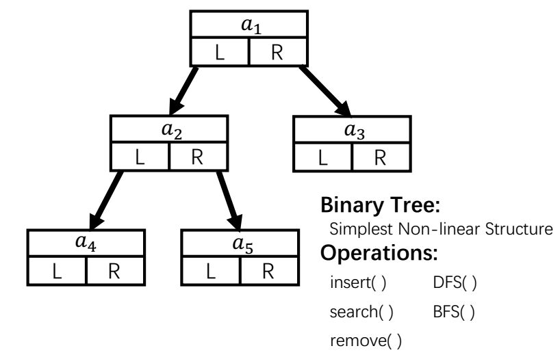

## Leetcode Problem Categories

**Linear Structure**

* **Heap**
    
    [Problem 671: Second Minimum Node in a Binary Tree](problem671.md)(heap-sort-like algorithm, discussion TBD)  
    [Problem 703: Kth Largest Element in a Stream](problem703.md)

* **Stack**
    <table><tr><td></td></tr></table>  

    [Problem 232: Implement Queue Using Stacks](problem232.md)   
    [Problem 155: Min Stack](problem155.md)
    
* **List**

    [Problem 83: Remove Duplicates from Sorted List](problem83.md)  
    [Problem 141: Linked List Cycle](problem141.md)   
    [Problem 160: Intersection Of Two Linked Lists](problem160.md)  
    [Problem 203: Remove Linked List Elements](problem203.md)  
    [Problem 234: Palindrome Linked List](problem234.md)  

**Non-linear structure**

* **Binary Tree**
    <table><tr><td></td></tr></table>  

    [Problem 101: Symmetric Tree](problem101.md)   
    [Problem 111: Minimum Depth of Binary Tree](problem111.md)  
    [problem 226: Invert Binary Tree](problem226.md)  
    [Problem 235: Lowest Common Ancestor of a Binary Search Tree](problem235.md)  
    [Problem 257: Binary Tree Paths](problem257.md)  
    [Problem 437: Path Sum III](problem437.md)  
    [Problem 543: Diameter of Binary Tree](problem543.md)  
    [Problem 572: Subtree Of Another Tree](problem572.md)    
    [Problem 687: Longest Univalue Path](problem687.md)  
    [Problem 704: Binary Search](problem704.md)
    

* **Hash-map**

    [Problem 543: Diameter of Binary Tree](problem543.md)  
    [Problem 705: Design Hashset](problem705.md)  
    [Problem 819: Most Common Word](problem819.md)  
    
* **Graph**
    [Problem -1: 兔子过河](problem-1.md)(Dijkstra algorithm for shortest path)   
    [Problem 198: House Robber](problem198.md)(sparse-connected graph, with discussion, with extension: Robbing Analysis)  
    [Problem 743: Network Delay Time](problem743.md)(Dijkstra algorithm for shortest path)  
    [Problem 746: Min Cost Climbing Stairs](problem746.md)(sparse-connected graph)  
    

