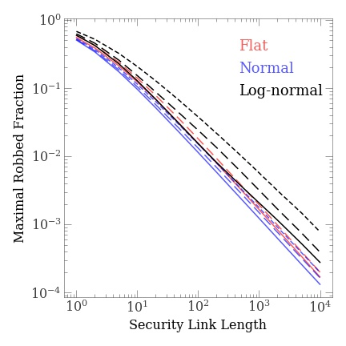

## Problem 198: House Robber

problem: [House Robber](https://leetcode.com/problems/house-robber/)

### Solution

- [Python](../python/problem198.py)

- [C++](../cpp/problem198.cpp)

- [Swift](../swift/problem198.swift)

- [Java](../java/problem198.java)

### Discussion

**Solution**

此题解法可参见[Swift code](../swift/problem198.swift)。思路是，对于输入数组`[a(1),a(2),a(3), ..., a(n)]`，先求得子列`S(i):=[a(1),a(2),a(3), ..., a(i) ] (i<=n)`的最优解`s[i]`。假设子列最优解`s[i-2],s[i-1]`都已经求出，那么求解`s[i]`是自然的，其结果为
```txt
s[i] = max( s[i-2] + a[i], s[i-1] ).
```
因为，要么不偷`a[i]`，那么最优解就是只偷子列`S[i-1]`时的最优解。而假设偷了`a[i]`，那么`a[i-1]`不能被再偷，只能再加上子列`S[i-2]`的最优解。如此反复迭代，就能得到整个序列的最优解。

**更一般的问题和解法**

我们稍微修改一下问题：现在，每一个房子不仅仅是连接着临近的1个房子，而是连接着最近的`NLink`个房子。Robber不能同时偷任意两个链接着的房子。改变后，思路是仍然是简单的，对于输入数组`[a(1),a(2),a(3), ..., a(n)]`，先求得子列`S(i):=[a(1),a(2),a(3), ..., a(i) ] (i<=n)`的最优解`s[i]`。假设子列最优解`s[i-NLink-1], ... s[i-2],s[i-1]`都已经求出，那么求解`s[i]`是自然的，其结果为
```txt
s[i] = max( s[i-NLink-1] + a[i], s[i-1] ).
```
如此反复迭代，就能得到最终结果。不过这里需要保存最近得到的`NLink+1`个子列最优解，因而需要增加一些复杂度。我们采用一个定长的循环链表就可以解决这些临时解的存储问题。相应的解法可以参考 [C++ code](../cpp/problem198.cpp)。


**Robbing Analysis**

我们进一步利用这里的解决方案讨论如何成为一个优秀的小偷。我们讨论一些可能影响小偷收益的因素，这主要包括
* 居民房屋内藏的钱数及其分布`P`
* 安保措施的链接长度`NLink`
* 不同社会阶级的居民住所的成团性

第一个因素对小偷收益的影响似乎不那么明显，但是仍然值得测试，因为显然不同国家的居民收入结构不同，分析清楚后就可以知道在美国容易成功还是在中国容易成功。第二个因素对偷盗收入的影响应该是显著的。而第三个因素则考虑了富人一般为了避免和穷人共享资源，就会建立一些小圈子，大家住在一起，把穷人排挤出去；如果安保的长度恰好能覆盖这个圈子，小偷就不可能在一个圈子里同时偷两家富人，所以这也需要考虑。

综合上面的考虑，我们考虑这样一个样本：一个500000户的城市（在中国称为“大城市”），而从问题的输入参量是一个`500000`长度的数组，每个数满足一定的分布。给定分布、成团性后，就可以产生一个随机数组，再给定连接长度后，就可以用我们上面的解法来测试小偷最多能偷多少钱。我们将小偷所偷的钱归一化处理，转为偷得的钱占所有民居总钱数的比例，取值范围是0到1。

然而一次测试可能不够准确，我们重复产生53组平均数（据悉，中国人口超过2000000，大概也就是民居超过500000的城市数目是53个），求平均值和方差，进而能够刻画小偷收入的稳定性。

我们三个概率模型`P`。（1）均匀分布（`Flat`），（2）正态分布（`Normal`），（3）对数正态分布（`Log-normal`）。我们考虑安保措施的链接长度`NLink`从`1`变化到`10000`。对于成团性的处理，一种方案是类似于统计物理里的`Ising Model`，让近邻的spin的状态分布受周围spin的影响。这里我们考虑一个更简单的方法：用一个参数`NCorr`描述关联长度，当挨个产生一组随机数时，如果某个随机数超过了正态分布`(mu, sigma)`的`2 sigma`之外，我们就接着产生`NCorr`个满足正态分布`(mu+2sigma, sigma)`的随机数。为了保证随机数整体均值不移动，我们再接着产生`NCorr`个满足正态分布`(mu-2sigma, sigma)`的随机数，之后，复原随机数产生器到最开始的状态，继续产生正态随机数。

下图展示了`P`为`[0,200]`的均匀分布时，不同的安保链接长度`NLink`时小偷能偷得的钱所占总钱数的比例。结果是显然的：对于一个安保完善的城市，比如`NLink=10000`的时候，小偷最多只能偷得大约万分之一的钱。但是，一个安保不那么好的城市就很值得一试了，几乎可以把居民的超过一半的钱偷走（中国有句古话叫做闷声发大财，还是不要搞这么大的事情比较好，得细水长流）。另外我们发现偷盗所得的`variance`还是不大的。


下图展示了不同分布时的偷盗所得与安保强度的关系。这里采用了均匀分布：`[30,170]`（红色实线），`[0,200]`（红色虚线）；正态分布`(100,10)`（蓝色实线），`(100,20)`（蓝色虚线），`(100,30)`（蓝色点子）；对数正态分布`(0.1，0.2)`（黑色实线），对数正态分布`(0.1，0.3)`（黑色虚线），对数正态分布`(0.1，0.5)`（黑色点子）。可以发现，不同的分布下，偷盗收入还是差别很大的，在安保措施最严格时，甚至可以差一个数量级。对于最均匀的分布，所得比正态分布好一点，而偏态的分布更好，并且偏得越多，收入越多。事实上，随着分布从正态走向Flat走向对数正态，中产阶级人数逐步减少，穷人逐渐增多，此时，偷盗所得增加。也就是说，小偷猖獗容易使得穷人占更大比例的国家的钱被偷走，所以作案时有必要考虑国家的阶级构成。



最后我们展示了不同阶级的居民分布成团性（用关联长度`NCorr`表示）对于小偷收入的影响。这里的几率模型都是正态分布`(100,33)`。可以发现，富人扎堆分布有利于减少损失。并且，作案所得在安保长度恰为关联长度的2倍左右时取得一个低谷。这表明安保长度的设置需要与富人聚集区的大小匹配才能更好的防盗。而对于一个贼来说就应该选择两者严重失配的地方作案。


